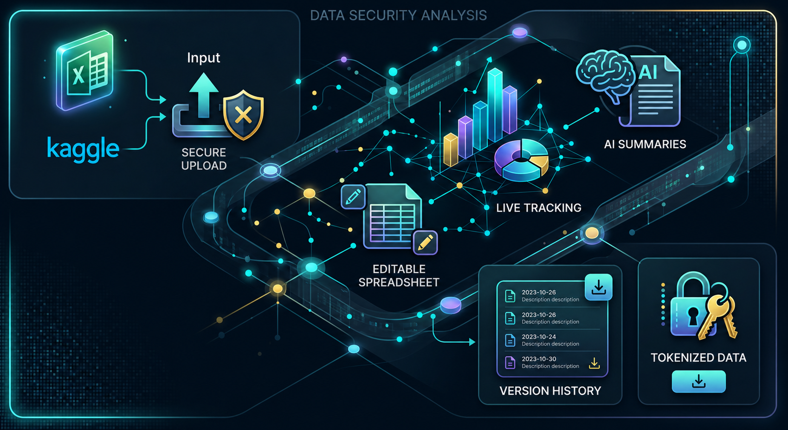
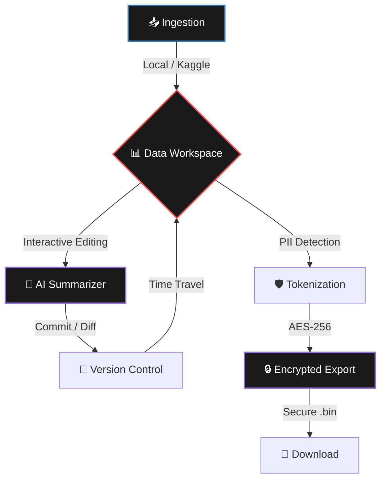

<p align="center">
  
</p>

<h1 align="center">🔐 Data Security & Version Control Platform</h1>

<p align="center">
  <strong>A premium, robust analysis environment designed for secure data ingestion, interactive editing, and AI-powered versioning.</strong>
</p>

<p align="center">
  
  
  
  
</p>

---

## 📸 Overview


> [!IMPORTANT]
> This platform ensures your sensitive spreadsheet data remains protected with advanced tokenization and encryption, while giving you powerful analytical and version control capabilities.

---

## 🌟 Visual Feature Matrix

| Feature | Description | Icon |
| :--- | :--- | :---: |
| **Seamless Ingestion** | Upload CSV/Excel or fetch directly from **Kaggle**. | 📥 |
| **Live Workspace** | Edit data natively in a high-performance grid. | 📊 |
| **AI Versioning** | LLM-generated summaries for every data commit. | 🧠 |
| **Tokenization** | SHA-256 hashing and masking for PII protection. | 🛡️ |
| **Full Encryption** | Industry-standard AES-256 file-level protection. | 🔒 |
| **Time Travel** | Revert workspace to any previous commit instantly. | ⏳ |

---

## 🔄 Data Lifecycle Architecture



---

## 🚀 Getting Started

### 📦 Installation

```bash
# 1. Clone the repository
git clone https://github.com/saeedangiz1/data-security-analysis.git
cd "data security, version controll"

# 2. Install dependencies
pip install -r requirements.txt

# 3. Launch the platform
streamlit run app.py
```

---

## ⚙️ Configuration

### 🔗 Kaggle Integration
1. Obtain `kaggle.json` from your [Kaggle Account](https://www.kaggle.com/settings).
2. Paste credentials in the **Settings** tab.

### 🤖 AI Engine
- **Cloud**: OpenAI, Abacus.ai, or Groq (OpenAI-compatible).
- **Local**: [Ollama](https://ollama.com/) (Default: `llama3` on `localhost:11434`).

---

## 🔒 Security Protocol
This application handles encryption keys in **memory only**. 

> [!WARNING]
> Decryption keys are NOT stored persistently. If you lose your key for an encrypted `.bin` file, the data is **permanently unrecoverable**.

---

<p align="center">
  
</p>

<p align="center">
  Built with ❤️ for Data Security Professionals
</p>

